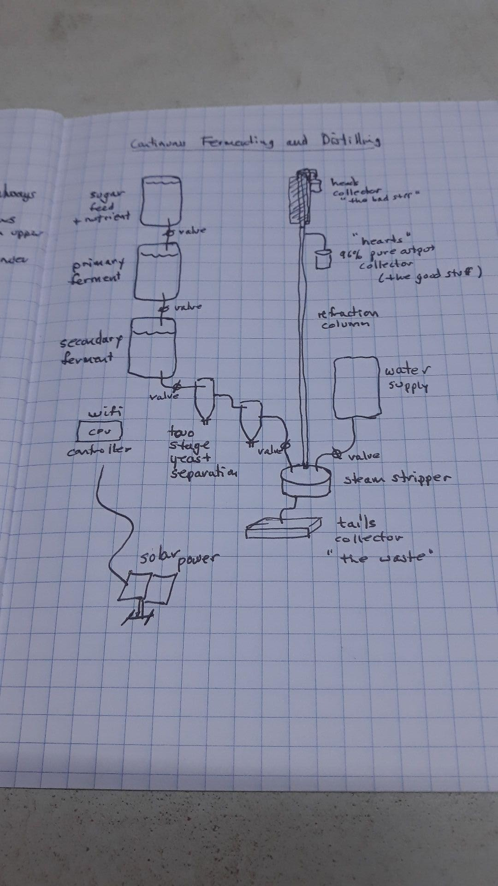

# vodak32
Low cost, low power, continuous micro-still using ESP32 to manage fermentation and distillation. Suitable for solar, off-grid or mobile, powered "just in time" (JIT) do-it-yourself (DIY) spirits production.

Status: **Design/Planning stage** - A work in progress...

Goal: Build a small "personal" still which can run on low power, off grid, solar systems without costing too much. An ideal would be requiring only 120W of power by utilizing a continuous steam injection process. An ESP32 has been chosen to control the various parts so that eventually it can just be self governing and let run as it will. It could either run "as the sun shines" with direct power or if large batteries are available then it could run more or even 24 hours/day, dependent on energy available. The target is producing about one bottle of 40% vodka per 6 hour sunny day with marginal cost being only the sugar and nutrients input.

Credits: This whole thing was inspired by the youtube channel "**tight**", which provides videos desscribing the various aspects of the continuous process as implemented for a small still capable of non-stop operation producing around 1L/day 96% ethanol output. I have merely taken his technical info and massaged it into a small "package" prioritising low power and adding continuous fermentation stages.

## Overview

To do - make a proper drawing of the system...

## Materials List

(the still parts)
- 1.5m x 25mm copper pipe ("the column")
- 30m x 1/2" copper tubing, annealed ("the stripper coil")
- 500ml stainless steel bottle ("the steam generator")
- 2 x 12V solenoid valves 
- 6 x DS18B20 temperature sensors
- 10m teflon heater wire
- 1 x 10L "keg" (plastic water containers you get free with drinking water) 
- a bunch of hose and barbs (details to follow)
- some insulation and aluminum foil

(the fermenter parts)
- 3 x 10L "kegs" (plastic water containers you get free with drinking water)
- 2 x 1L soda bottles (the schweppes kind have a nice shape)
- 3 x 12V solenoid valves
- 2 x DS18B20  temperature sensors
- more hose and barbs

(the control box)
- ESP32 CPU board
- LM2596 Buck converter module (set for 3.3V output)
- 1 or 2 x MOSFET 4 module (1 for still, 1 for fermenter)
- some connectors and wires to "tie the room together".

... more to come ...

