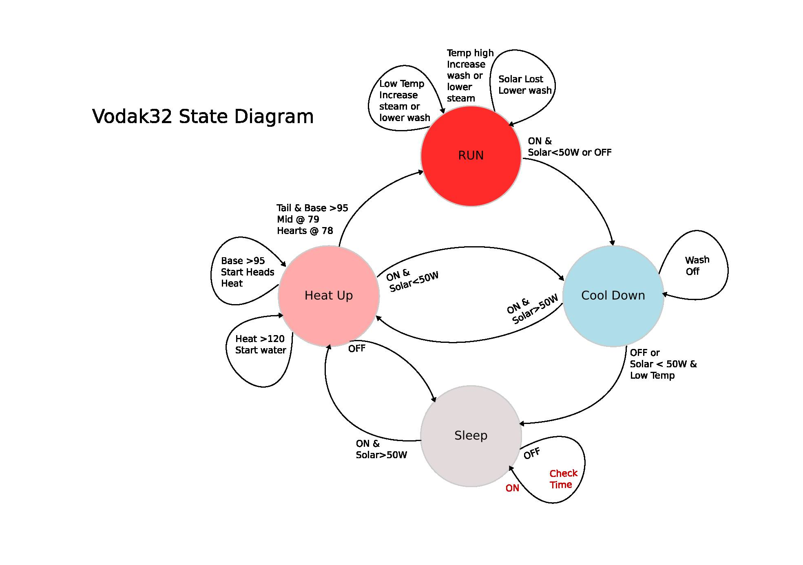

# vodak32
Low cost, low power, continuous micro-still using ESP32 to manage fermentation and distillation. Suitable for solar, off-grid or mobile, powered "just in time" (JIT) "do-it-yourself" (DIY) spirits production.

Status: **Initial Build stage** 

A work in progress... Some parts have arrived, the controller is built and half the code done. Testing separate parts of system.

**Goal**: Build a small "personal" still which can run on low power, off grid, solar systems without costing too much. An ideal would be requiring only 120W of power by utilizing a continuous steam injection process. An ESP32 has been chosen to control the various parts so that eventually it can run optimally on it's own. It could either run "as the sun shines" with direct power or if large batteries are available then it could run up to 24 hours/day. The target is producing about one bottle of 40% vodka per 6 hour sunny day with marginal cost being only the sugar and nutrients input.

**Credits**: This whole thing was inspired by the youtube channel "**[tight](https://www.youtube.com/@tight1449/videos)**", which provides videos describing the various aspects of the continuous process as implemented for a small still capable of non-stop operation producing around 1L/day 96% ethanol output. I have taken his technical info and adapted it into a small "package" prioritising low power and adding the continuous fermentation stages.

## Overview

## Web App

Simple Web interface using JSON to interact with server backend in ESP32.
Optimized for mobile phone use.

Modes:
- Auto - monitors solar and manages state transitions to best optimize still output
- Manual - user can view info and set control values
- Config - wifi settings and system parameters, calibrate valve flow timings

First rough draft of web app interface:

## Materials List

A [LibreCalc worksheet](docs/Materials%20List.ods) and [pdf](docs/Materials%20List.pdf) are included detailing required/optional build items and current costs. You can use this to plug in your own prices and estimate total build cost. For me it works out to under $100 USD.

## Docs and Tutorials

The [wiki](https://github.com/neocogent/vodak32/wiki) is the place for more details on design decisions and build tutorials. Just beginning on that but as I build there will be progressively more photos and instruction added.

... more to come ...

